# DR-石之家幻化模板导入

将石之家幻化详情页中的装备、部位、染色信息复制为 **Daily Routines - 统一投影管理器 - 投影模板管理器** 可识别的模板数据。

安装脚本成功后，打开石之家幻化详情页，页面右下角会出现复制按钮。点击按钮后，脚本会读取当前页面中的幻化装备信息，并写入本地剪贴板。回到游戏内 **Daily Routines - 统一投影管理器 - 投影模板管理器** 页面后，进行试穿或导入。

## 安装步骤

1. 安装浏览器扩展 [Tampermonkey](https://www.tampermonkey.net/)。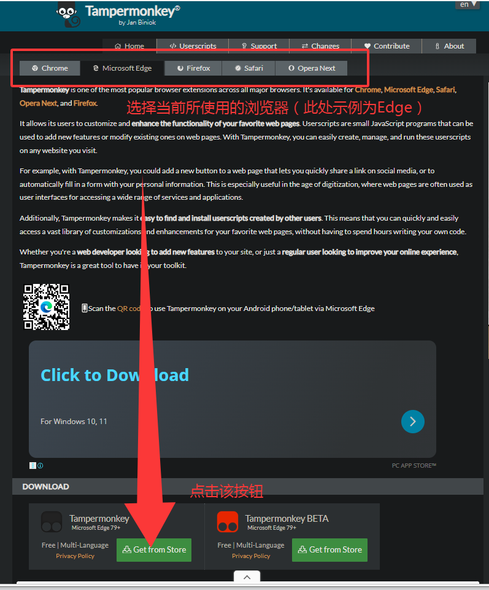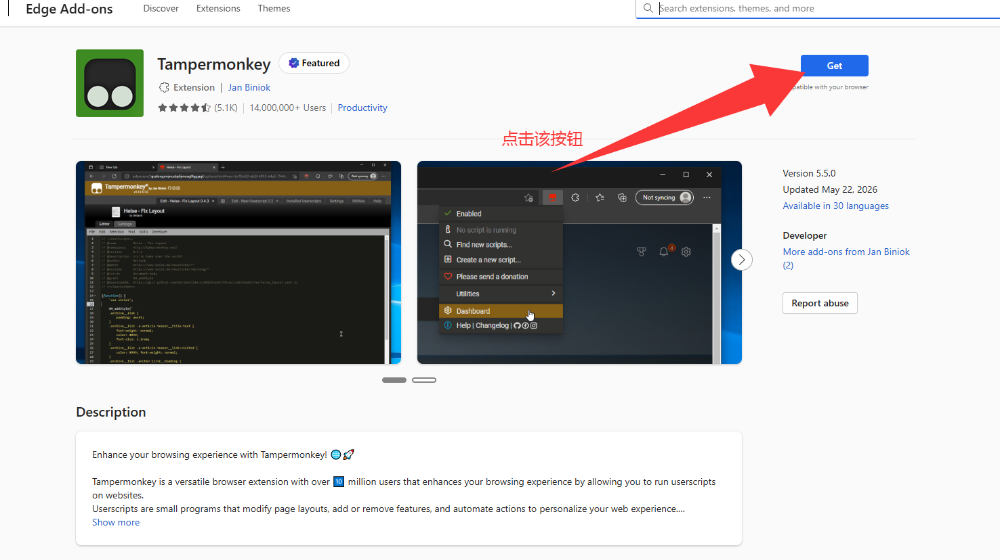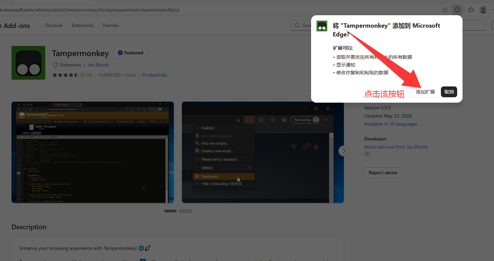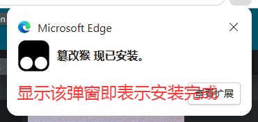
2. 安装石之家导入所需脚本。[石之家幻化模板导入DR脚本](https://greasyfork.org/en/scripts/580109-%E7%9F%B3%E4%B9%8B%E5%AE%B6%E5%B9%BB%E5%8C%96%E6%A8%A1%E6%9D%BF%E5%AF%BC%E5%85%A5dr)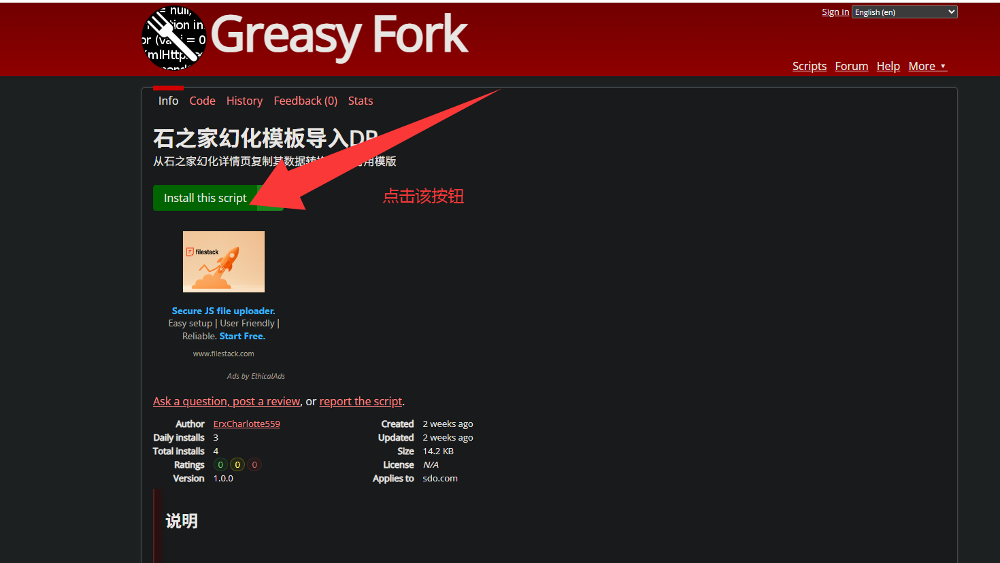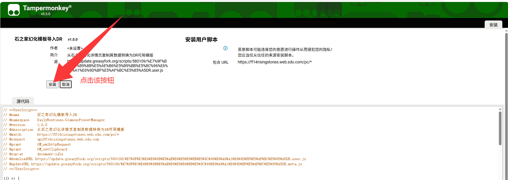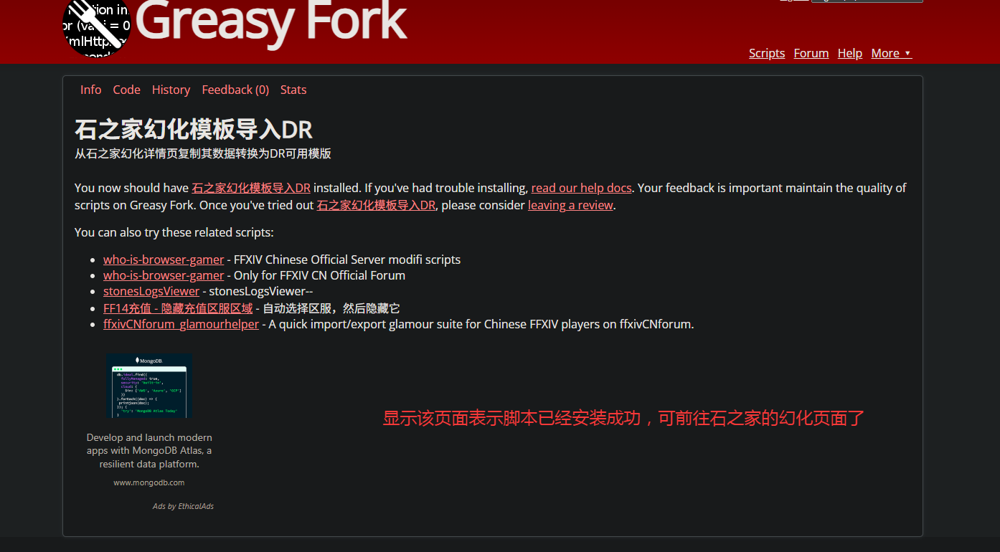
3. 前往石之家幻化页面 [石之家]([https://www.tampermonkey.net/](https://ff14risingstones.web.sdo.com/pc/index.html#/post))
4. 复制投影模板 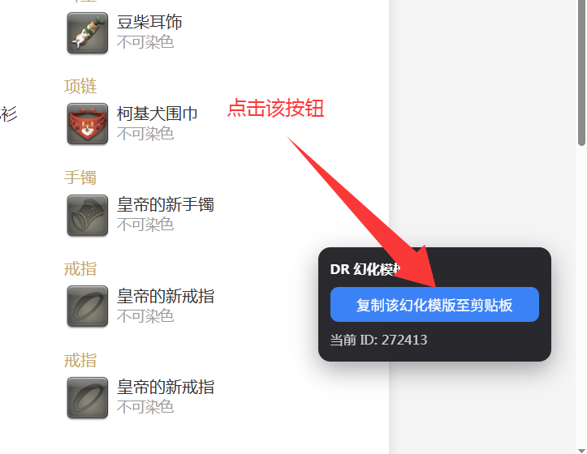
5. 在模块内试穿/导入投影模板 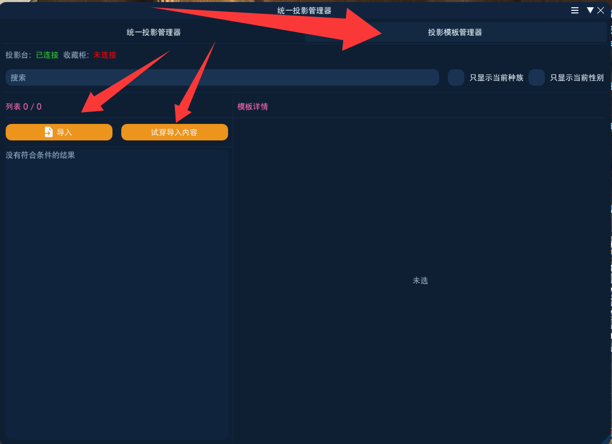

## 常见问题

如果脚本没有正常工作（页面右下角没有出现按钮），请先按下面步骤排查。
1. 已经安装并启用Tampermonkey。
2. 已经安装本脚本。
3. 当前打开的是石之家幻化详情页，而不是列表页、个人主页或其他页面。浏览器地址中应包含类似下面的路径：/glamour/detail/数字
4. 查看Tampermonkey扩展是否显示如图内容，如果显示 请启用“允许用户脚本”扩展设置，说明浏览器还没有开启用户脚本权限。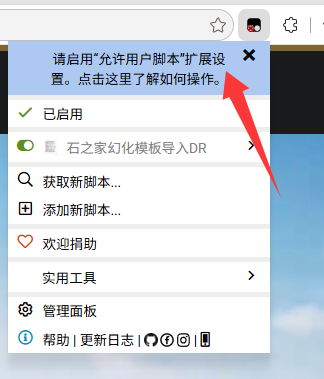
   - 如图打开管理扩展页面 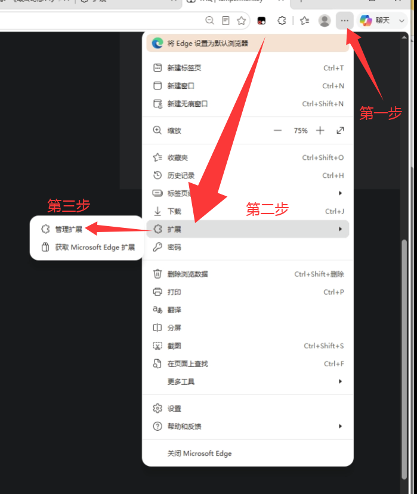
   - 找到Tampermonkey扩展，并点击详细信息 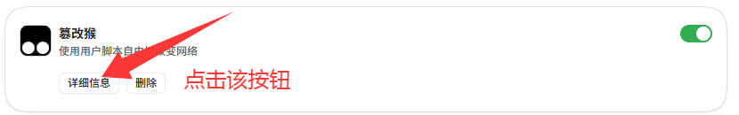
   - 找到允许用户脚本并启动 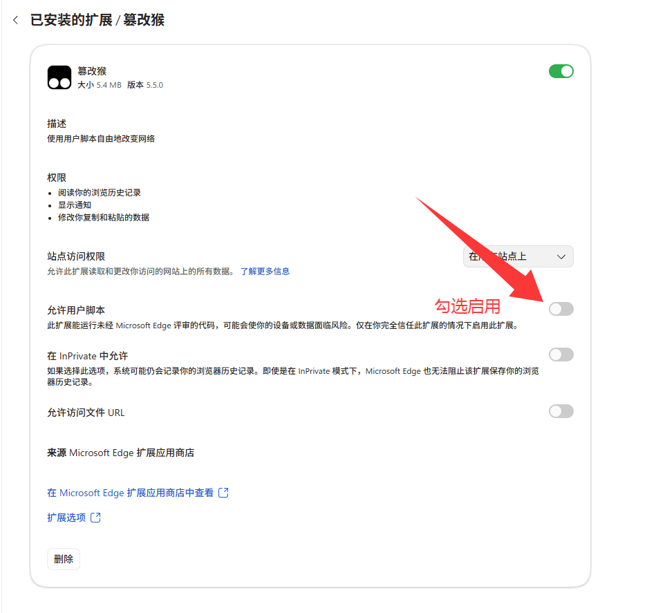
   - 返回石之家幻化页面查看脚本是否正常工作

## 注意事项

* 本脚本需要配合 **Daily Routines - 统一投影管理器 - 投影模板管理器** 使用。
* 石之家页面结构或接口变动时，脚本可能需要同步更新。
* 本脚本不是 Square Enix、盛趣游戏、石之家官方功能，仅用于辅助玩家将公开页面中的幻化信息转换为DR模块可用的模板数据，使用者应自行确认脚本内容与使用风险。

## 反馈问题时请提供

如果遇到无法识别或导入失败，请尽量提供以下信息：

1. 石之家幻化详情页链接或幻化 ID
2. 无法识别的装备/染色名称
4. 浏览器名称与版本

